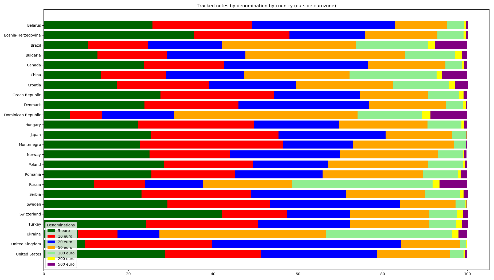

# Tracking statistics for high-denomination euro banknotes

## Banknotes in circulation versus practical use

The euro has seven banknote denominations: 5, 10, 20, 50, 100, 200 and 500 euro.

Official circulation data indicates that the 5, 10, 20, 50 and 100 euro notes are most common [1].
The 200 and 500 euro notes are less common relative to the other denominations, but together
they still make up roughly 3% of all Euro banknotes in circulation.

| 5 euro | 10 euro | 20 euro | 50 euro | 100 euro | 200 euro| 500 euro|
|---|---|---|---|---|---|---|
| 7.2% | 10.1% | 16.1% | 49.1% | 13.5% | 2.0% | 1.0% | 

The circulation data seems to differ from how the denominations are used
in practice in some countries. For example, in The Netherlands, only the 5, 10, 20 and 50 euro
notes are in everyday use in most areas. These lower-denomination notes are available in ATMs and generally accepted by
shops. In a 2021 survey, the Dutch national bank (DNB) found that a majority of respondents
had never held a 200 euro note and/or a 500 euro note [2]. Although a majority had held a 100 euro
note, most people did not have one in the past year.

This begs the question where all of these high-denomination notes are, if people seem to use them only
rarely. An interesting source of information about this topic is https://eurobilltracker.com - a website where
members can enter serial numbers of their euro banknotes. If multiple members see the same banknote, it
is possible to track how the note travelled. This document uses data from EuroBillTracker to show in
which countries high-denomination euro banknotes are reportedly used most frequently, both relative
to low-denomination notes and in absolute numbers. The repository also contains the processed data
and scripts that were used to create the graphs and tables.

## Summary data

The tables and plots show the Eurobilltracker denomination data by country over the past (roughly) 20 years (2002-2022).
Only countries with more than 6000 notes entered (on average, roughly 300 notes per year) have been included. Data
for countries inside and outside the eurozone is listed in separate tables and plots.

|Country|5 euro|10 euro|20 euro|50 euro|100 euro|200 euro|500 euro|
|-------|------|-------|-------|-------|--------|--------|--------|
|Andorra|37.4|21.6|19.1|14.8|6.0|0.5|0.7|
|Austria|44.1|31.9|11.2|7.0|4.7|0.6|0.5|
|Belgium|45.3|18.7|20.9|13.4|1.2|0.2|0.3|
|Cyprus|42.5|17.9|26.1|11.7|1.5|0.1|0.2|
|Estonia|57.3|19.2|15.2|8.0|0.2|0.1|0.1|
|Finland|33.6|19.6|31.9|13.5|1.0|0.2|0.3|
|France|33.7|29.4|26.5|9.4|0.9|0.1|0.1|
|Germany|52.6|22.0|12.5|10.6|1.8|0.2|0.3|
|Greece|26.9|20.0|24.3|26.1|2.2|0.1|0.2|
|Ireland|37.3|26.5|23.6|12.2|0.3|0.0|0.0|
|Italy|27.1|22.8|24.5|23.2|2.1|0.1|0.2|
|Latvia|28.8|25.3|24.5|20.4|0.8|0.1|0.2|
|Lithuania|51.8|18.8|11.9|13.0|3.9|0.5|0.1|
|Luxembourg|33.0|25.3|23.3|15.3|2.2|0.6|0.6|
|Malta|14.8|40.9|30.5|12.5|0.8|0.2|0.3|
|Monaco|51.9|13.6|15.9|12.8|4.6|0.7|0.5|
|Netherlands|36.9|29.2|18.7|14.0|0.9|0.2|0.1|
|Portugal|23.9|30.7|37.4|6.5|1.0|0.2|0.2|
|San Marino|40.9|22.9|19.6|14.3|2.1|0.2|0.0|
|Slovakia|27.3|32.7|18.4|14.1|6.4|0.4|0.7|
|Slovenia|31.7|25.4|28.9|9.9|3.3|0.3|0.6|
|Spain|25.5|23.3|26.1|23.2|1.3|0.2|0.4|
|Vatican City|21.2|17.0|16.3|37.4|7.4|0.4|0.2|

|Country|5 euro|10 euro|20 euro|50 euro|100 euro|200 euro|500 euro|
|-------|------|-------|-------|-------|--------|--------|--------|
|Belarus|25.7|23.5|33.6|12.4|4.0|0.5|0.4|
|Bosnia-Herzegovina|35.5|22.5|17.8|17.1|6.2|0.6|0.4|
|Brazil|10.4|14.2|17.5|31.5|17.2|1.5|7.6|
|Bulgaria|12.7|16.4|18.5|37.7|11.8|1.7|1.1|
|Canada|23.7|18.8|34.1|18.2|3.9|0.5|0.8|
|China|13.6|15.2|18.4|25.0|20.5|1.2|6.0|
|Croatia|17.3|21.7|20.5|22.9|13.2|1.5|3.0|
|Czech Republic|27.6|26.8|20.3|16.1|7.2|1.1|0.9|
|Denmark|23.8|22.2|30.8|18.1|4.0|0.7|0.4|
|Dominican Republic|6.2|7.5|17.0|43.4|15.1|2.1|8.7|
|Hungary|22.3|27.3|20.1|20.9|8.0|0.6|0.8|
|Japan|25.3|30.1|25.3|15.7|3.2|0.2|0.1|
|Montenegro|22.8|33.6|16.6|23.8|2.8|0.1|0.2|
|Norway|25.0|19.0|26.0|23.0|6.0|0.3|0.5|
|Poland|28.3|21.1|17.6|23.7|8.2|0.5|0.6|
|Romania|25.4|19.8|20.6|23.8|8.2|0.6|1.5|
|Russia|11.9|12.0|13.7|21.0|33.2|1.6|6.6|
|Serbia|23.1|25.9|22.4|18.7|8.1|0.9|1.0|
|Sweden|29.2|24.2|30.7|13.1|2.3|0.3|0.2|
|Switzerland|42.1|15.3|15.0|18.6|6.5|1.5|1.1|
|Turkey|24.2|26.4|21.8|18.6|6.3|1.5|1.3|
|Ukraine|8.1|9.3|9.9|39.3|29.8|1.5|2.0|
|United Kingdom|9.8|30.0|44.5|13.9|1.5|0.2|0.1|
|United States|28.6|22.7|27.3|17.2|3.3|0.3|0.5|

The data shows that high-denomination notes occur with low frequency (less than, say, 1.5% of observed
notes) in some eurozone countries, including France, Ireland, Netherlands and Portugal. The frequencies
for Germany and Belgium are slightly higher. Within the eurozone, Austria, Lithuania, Luxembourg, Slovakia
and Slovenia stand out as countries with fairly high frequencies of high-denomination notes (up to roughly 8%).

Some countries outside the Eurozone have a frequency distribution of high-denomination notes that is fairly
similar to the eurozone countries. This is the case for Japan, Sweden, the United Kingdom and the United States.
Other non-eurozone countries have relatively high frequencies for the high-denomination notes. The most extreme
figures are those of Russia and Ukraine, where more than one in three observed notes is a high-denomination note.
The Dominican Republic, China, Brazil, as well as various central European and southeast European countries outside
the eurozone also have quite high rates for high-denomination notes, relative to the eurozone countries.

## Last data

The summary data covers a period of approximately 20 years. While this means a significant amount of data is available,
resulting in more reliable figures, it is possible that the data does not reflect the usage patterns in the past
year very well. For example, the 500 euro note is no longer being issued and distributed since 2019, and the number of notes in
circulation has declined since then.

This section contains the distribution of the past (roughly) 300 notes. Only countries with at least 300 observed notes in 2022
have been included. This data is based on much fewer observations and thus less reliable, but is based on only recent
data.

Last tracked notes by denomination by country (inside eurozone):

|Country|5 euro|10 euro|20 euro|50 euro|100 euro|200 euro|500 euro|
|-------|------|-------|-------|-------|--------|--------|--------|
|Austria|51.2|22.7|3.9|11.2|10.9|0|0|
|Belgium|30.3|17.9|36.7|14.5|0.6|0|0|
|Cyprus|19.1|14.5|39.4|23.9|1.8|1.2|0|
|Estonia|64.2|14.2|10.0|11.5|0|0|0|
|Finland|38.2|23.0|23.0|15.5|0|0.3|0|
|France|35.2|42.1|18.5|4.2|0|0|0|
|Germany|28.8|34.2|11.2|20.3|5.5|0|0|
|Greece|30.9|20.6|28.5|19.1|0.9|0|0|
|Ireland|48.8|19.7|14.8|16.4|0.3|0|0|
|Italy|7.9|14.2|64.5|13.0|0.3|0|0|
|Latvia|12.1|15.5|33.0|39.4|0|0|0|
|Lithuania|28.5|31.5|30.3|9.1|0.6|0|0|
|Luxembourg|29.4|21.5|29.1|14.8|5.2|0|0|
|Malta|1.2|25.5|63.3|10.0|0|0|0|
|Netherlands|39.1|21.2|16.4|22.4|0.6|0.3|0|
|Portugal|18.8|53.3|25.5|1.8|0|0|0.6|
|Slovakia|47.9|34.2|8.5|1.5|2.7|5.2|0|
|Slovenia|17.3|26.7|22.7|25.5|7.9|0|0|
|Spain|26.4|36.7|20.9|16.1|0|0|0|

Last tracked notes by denomination by country (outside eurozone):

|Country|5 euro|10 euro|20 euro|50 euro|100 euro|200 euro|500 euro|
|-------|------|-------|-------|-------|--------|--------|--------|
|Albania|10.6|7.3|13.0|54.5|13.0|0.3|1.2|
|Brazil|4.5|41.8|18.8|13.6|19.1|1.5|0.6|
|Bulgaria|13.9|20.6|23.6|30.0|4.2|7.6|0|
|Chile|0|0|0|100.0|0|0|0|
|Croatia|14.5|27.3|19.7|19.7|12.4|6.1|0.3|
|Cuba|26.1|37.0|29.7|7.3|0|0|0|
|Czech Republic|33.0|25.2|14.8|19.4|7.6|0|0|
|Denmark|43.6|5.5|33.3|16.4|0|0.9|0.3|
|Hungary|78.8|2.4|3.9|5.8|7.9|1.2|0|
|Japan|15.5|19.4|21.8|40.9|2.4|0|0|
|Liechtenstein|79.4|5.8|6.1|5.2|3.6|0|0|
|Montenegro|29.4|24.8|22.4|19.7|2.4|1.2|0|
|Poland|9.1|17.6|21.5|29.7|20.3|1.5|0.3|
|Romania|26.7|19.4|26.7|21.5|4.8|0.9|0|
|Russia|1.8|6.4|3.0|16.4|58.8|13.3|0.3|
|Serbia|1.5|4.8|4.8|71.5|6.1|10.3|0.9|
|Sweden|13.3|15.8|59.1|10.9|0.3|0.6|0|
|Switzerland|1.2|53.3|31.8|4.8|8.8|0|0|
|Turkey|4.5|7.3|7.3|56.4|11.2|9.4|3.9|
|Ukraine|11.5|6.1|0.6|81.8|0|0|0|
|United Kingdom|4.8|7.0|76.4|10.9|0.9|0|0|
|United States|61.5|10.6|14.5|13.0|0.3|0|0|

In the eurozone countries, only one country had a 500 euro note in the last notes, whereas
it was more widespread in the summary data. Only four countries had a 200 euro note among the
last notes, so it does not seem that the 200 euro note is replacing the 500 euro note in most
countries in the eurozone. The 100 euro notes were still widespread in the last notes data,
with significant numbers in Austria, Germany, Luxembourg, Lithuania, Slovakia and Slovenia.

Outside of the eurozone countries, the frequency of 500 euro notes in the last notes seems to
also have declined relative to the summary data over the past two decades. For the non-eurozone
countries, the 200 euro note seems to have become much more prevalent in some countries, possibly as a
replacement for the 500 euro note. The 100 euro notes are still widepread in countries such as
Russia, as well as several non-eurozone eastern and southeastern European countries.

## Percentage of notes by country / area

Rather than consider the relative use of denominations within a country, we can also consider
the distribution of high-denomination notes across countries.  All three high denominations show a similar
pattern. Most notes are observed in Germany and Austria. The number of observations outside
the eurozone is small relative to those within the eurozone countries, at roughly 2%. This figure seems to
be mich lower than ECB estimates, which are that roughly 20 to 30% of all euro banknotes (by value) are held outside the
eurozone [3,4]. The difference can at least partially be attributed to scope of the data, where Eurobilltracker data mainly
is collected from consumers and small businesses, whereas ECB data is about all use (including, say, currency
reserves).

# Conclusions

Eurobilltracker data is not necessarily representative of how the population in general uses banknotes. For
example, some Eurobilltracker members might prefer to use more low-denomination notes, so that they can enter
more bills and potentially get more hits. It is also possible that (country) data is skewed by a small number of very
prolific members. Furthermore, Eurobilltracker members probably represent mainly individual persons and small
businesses, so banknotes stored by, say, banks are presumably not reflected in this data. Finally, it is not recorded
whether Eurobilltrackers travel internationally with notes they received. For example, a Dutch member might withdraw
a banknote in Germany, but spend it in the Netherlands. Because of these limitations, Eurobilltracker data needs to
be considered together with other data sources.

High-denomination euro banknotes seem to be used more often (relative to low-denomination banknotes) in some
countries outside the eurozone, including Russia, China, Brazil and various central and southeast European countries.
In most of these countries, the 100 euro notes are most common. The 500 euro note used to be the second-most common,
but seems to be in the process of being replaced by the 200 euro note.

Within the eurozone, 200 and 500 euro notes tend to be used very rarely, relative to the lower-denomination notes, and use
of the 500 euro note seems to already have declined in the past few years. The use of 100 euro notes within the eurozone
varies by country. Whereas these notes appear to be relatively rare in some countries, such as Ireland, The Netherlands and
Portugal, they are more common in other countries, such as Austria, Germany, Slovakia and Slovenia.

Roughly half of the high-denomination banknotes were observed in Austria and Germany. Most of the rest was observed
in the other eurozone countries, with only roughly 2% observed outside the eurozone.

## Sources

* [1] *Banknotes and coins circulation* (2022). European Central Bank (ECB).
      https://www.ecb.europa.eu/stats/policy_and_exchange_rates/banknotes+coins/circulation/html/index.en.html
* [2] *Bekendheid en Waardering Bankbiljetten* (2021). De Nederlandse Bank (DNB), in Dutch. Page 11.
      https://www.dnb.nl/media/xyldnnnt/bekendheid-en-waardering-bankbiljetten.pdf
* [3] *The euro - Issuance and circulation* (2022). European Central Bank (ECB).
      https://www.ecb.europa.eu/euro/intro/issuance/html/index.en.html
* [4] *Foreign demand for euro banknotes* (2021). European Central Bank (ECB).
      https://www.ecb.europa.eu/pub/pdf/scpops/ecb.op253~5a3d5de1d1.en.pdf

The picture of the first series banknotes is in the public domain, see
https://commons.wikimedia.org/wiki/File:Euro_banknotes,_First_series.png for source information.

## License

Creative Commons CC-BY-SA 4.0 license; see
https://creativecommons.org/licenses/by-sa/4.0/legalcode.txt or enclosed
LICENSE file
