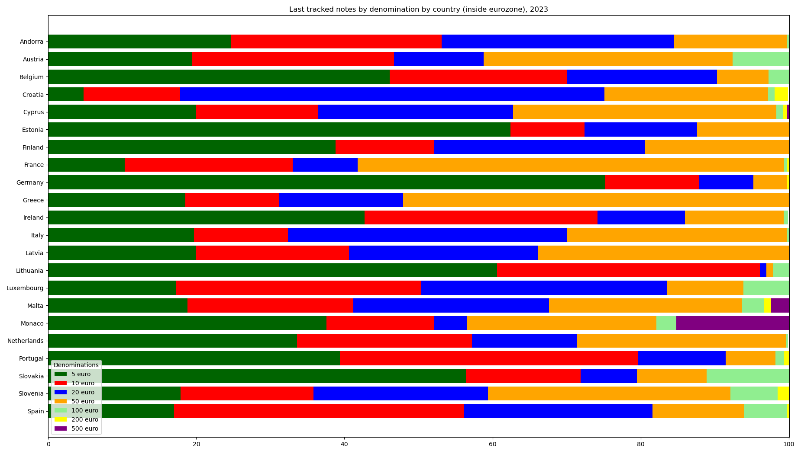
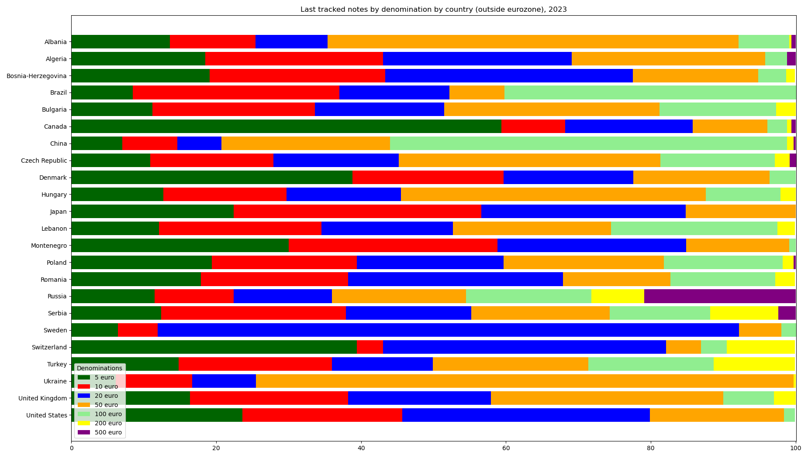

## Update last data for 2023

The data for the last 330 notes per country in 2023 resemble the data for 2022.

Last tracked notes by denomination by country (inside eurozone), 2023:

|Country|5 euro|10 euro|20 euro|50 euro|100 euro|200 euro|500 euro|
|-------|------|-------|-------|-------|--------|--------|--------|
|Andorra|24.7|28.4|31.4|15.2|0.3|0|0|
|Austria|19.4|27.3|12.1|33.6|7.6|0|0|
|Belgium|46.1|23.9|20.3|7.0|2.7|0|0|
|Croatia|4.8|13.0|57.3|22.1|0.9|1.8|0|
|Cyprus|20.0|16.4|26.4|35.5|0.9|0.6|0.3|
|Estonia|62.4|10.0|15.2|12.4|0|0|0|
|Finland|38.8|13.3|28.5|19.4|0|0|0|
|France|10.3|22.7|8.8|57.6|0.3|0.3|0|
|Germany|75.2|12.7|7.3|4.5|0|0.3|0|
|Greece|18.5|12.7|16.7|52.1|0|0|0|
|Ireland|42.7|31.5|11.8|13.3|0.6|0|0|
|Italy|19.7|12.7|37.6|29.7|0.3|0|0|
|Latvia|20.0|20.6|25.5|33.9|0|0|0|
|Lithuania|60.6|35.5|0.9|0.9|2.1|0|0|
|Luxembourg|17.3|33.0|33.3|10.3|6.1|0|0|
|Malta|18.8|22.4|26.4|26.1|3.0|0.9|2.4|
|Monaco|37.6|14.5|4.5|25.5|2.7|0|15.2|
|Netherlands|33.6|23.6|14.2|28.2|0.3|0|0|
|Portugal|39.4|40.3|11.8|6.7|1.2|0.6|0|
|Slovakia|56.4|15.5|7.6|9.4|11.2|0|0|
|Slovenia|17.9|17.9|23.6|32.7|6.4|1.5|0|
|Spain|17.0|39.1|25.5|12.4|5.8|0.3|0|

Last tracked notes by denomination by country (outside eurozone), 2023:

|Country|5 euro|10 euro|20 euro|50 euro|100 euro|200 euro|500 euro|
|-------|------|-------|-------|-------|--------|--------|--------|
|Albania|13.6|11.8|10.0|56.7|7.0|0.3|0.6|
|Algeria|18.5|24.5|26.1|26.7|3.0|0|1.2|
|Bosnia-Herzegovina|19.1|24.2|34.2|17.3|3.9|1.2|0|
|Brazil|8.5|28.5|15.2|7.6|40.3|0|0|
|Bulgaria|11.2|22.4|17.9|29.7|16.1|2.7|0|
|Canada|59.4|8.8|17.6|10.3|2.7|0.6|0.6|
|China|7.0|7.6|6.1|23.3|54.8|0.9|0.3|
|Czech Republic|10.9|17.0|17.3|36.1|15.8|2.1|0.9|
|Denmark|38.8|20.9|17.9|18.8|3.6|0|0|
|Hungary|12.7|17.0|15.8|42.1|10.3|2.1|0|
|Japan|22.4|34.2|28.2|15.2|0|0|0|
|Lebanon|12.1|22.4|18.2|21.8|23.0|2.4|0|
|Montenegro|30.0|28.8|26.1|14.2|0.9|0|0|
|Poland|19.4|20.0|20.3|22.1|16.4|1.5|0.3|
|Romania|17.9|20.3|29.7|14.8|14.5|2.7|0|
|Russia|11.5|10.9|13.6|18.5|17.3|7.3|20.9|
|Serbia|12.4|25.5|17.3|19.1|13.9|9.4|2.4|
|Sweden|6.4|5.5|80.3|5.8|2.1|0|0|
|Switzerland|39.4|3.6|39.1|4.8|3.6|9.4|0|
|Turkey|14.8|21.2|13.9|21.5|17.3|11.2|0|
|Ukraine|6.1|10.6|8.8|74.2|0|0.3|0|
|United Kingdom|16.4|21.8|19.7|32.1|7.0|3.0|0|
|United States|23.6|22.1|34.2|18.5|1.5|0|0|

