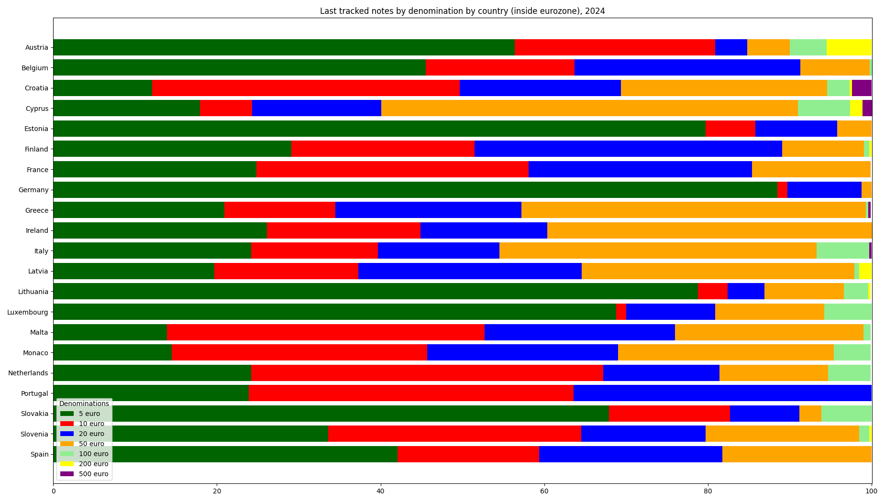
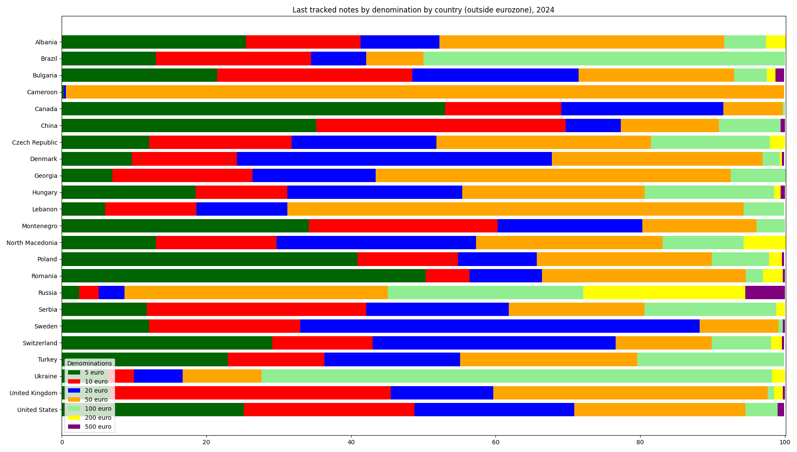

## Update last data for 2024

The data for the last 330 notes per country in 2024 resemble the data for 2022 and 2023

Last tracked notes by denomination by country (inside eurozone), 2024:

|Country|5 euro|10 euro|20 euro|50 euro|100 euro|200 euro|500 euro|
|-------|------|-------|-------|-------|--------|--------|--------|
|Austria|56.4|24.5|3.9|5.2|4.5|5.5|0|
|Belgium|45.5|18.2|27.6|8.5|0.3|0|0|
|Croatia|12.1|37.6|19.7|25.2|2.7|0.3|2.4|
|Cyprus|17.9|6.4|15.8|50.9|6.4|1.5|1.2|
|Estonia|79.7|6.1|10.0|4.2|0|0|0|
|Finland|29.1|22.4|37.6|10.0|0.6|0.3|0|
|France|24.8|33.3|27.3|14.5|0|0|0|
|Germany|88.5|1.2|9.1|1.2|0|0|0|
|Greece|20.9|13.6|22.7|42.1|0.3|0|0.3|
|Ireland|26.1|18.8|15.5|39.7|0|0|0|
|Italy|24.2|15.5|14.8|38.8|6.4|0|0.3|
|Latvia|19.7|17.6|27.3|33.3|0.6|1.5|0|
|Lithuania|78.8|3.6|4.5|9.7|3.0|0.3|0|
|Luxembourg|68.8|1.2|10.9|13.3|5.8|0|0|
|Malta|13.9|38.8|23.3|23.0|0.9|0|0|
|Monaco|14.5|31.2|23.3|26.4|4.5|0|0|
|Netherlands|24.2|43.0|14.2|13.3|5.2|0|0|
|Portugal|23.9|39.7|36.4|0|0|0|0|
|Slovakia|67.9|14.8|8.5|2.7|6.1|0|0|
|Slovenia|33.6|30.9|15.2|18.8|1.2|0.3|0|
|Spain|42.1|17.3|22.4|18.2|0|0|0|

Last tracked notes by denomination by country (outside eurozone), 2024:

|Country|5 euro|10 euro|20 euro|50 euro|100 euro|200 euro|500 euro|
|-------|------|-------|-------|-------|--------|--------|--------|
|Albania|25.5|15.8|10.9|39.4|5.8|2.7|0|
|Brazil|13.0|21.5|7.6|7.9|50.0|0|0|
|Bulgaria|21.5|27.0|23.0|21.5|4.5|1.2|1.2|
|Cameroon|0.3|0|0.3|99.3|0|0|0|
|Canada|53.0|16.1|22.4|8.2|0.3|0|0|
|China|35.2|34.5|7.6|13.6|8.5|0|0.6|
|Czech Republic|12.1|19.7|20.0|29.7|16.4|2.1|0|
|Denmark|9.7|14.5|43.6|29.1|2.4|0.3|0.3|
|Georgia|7.0|19.4|17.0|49.1|7.6|0|0|
|Hungary|18.5|12.7|24.2|25.2|17.9|0.9|0.6|
|Lebanon|6.0|12.6|12.6|63.1|5.6|0|0|
|Montenegro|34.2|26.1|20.0|15.8|3.9|0|0|
|North Macedonia|13.0|16.7|27.6|25.8|11.2|5.8|0|
|Poland|40.9|13.9|10.9|24.2|7.9|1.8|0.3|
|Romania|50.3|6.1|10.0|28.2|2.4|2.7|0.3|
|Russia|2.4|2.7|3.6|36.4|27.0|22.4|5.5|
|Serbia|11.8|30.3|19.7|18.8|18.2|1.2|0|
|Sweden|12.1|20.9|55.2|10.9|0.6|0|0.3|
|Switzerland|29.1|13.9|33.6|13.3|8.2|1.5|0.3|
|Turkey|23.0|13.3|18.8|24.5|20.3|0|0|
|Ukraine|6.4|3.6|6.7|10.9|70.6|1.8|0|
|United Kingdom|6.7|38.8|14.2|37.9|0.9|1.2|0.3|
|United States|25.2|23.6|22.1|23.6|4.5|0|0.9|

