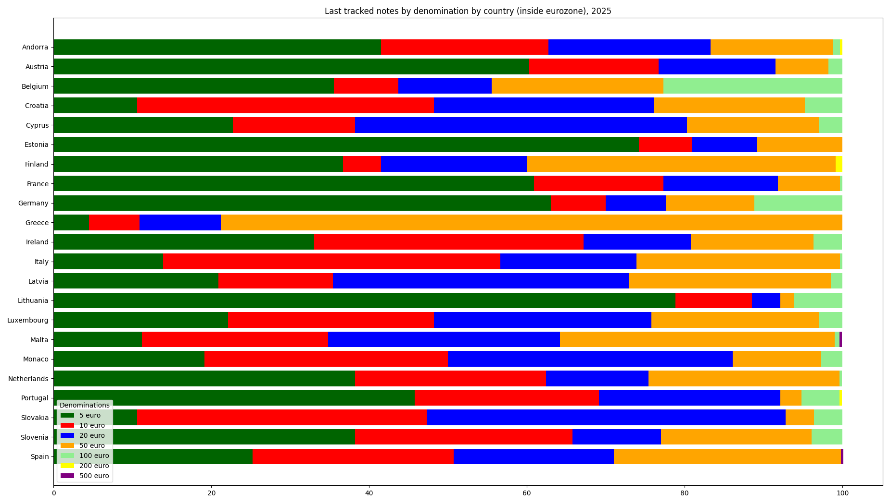
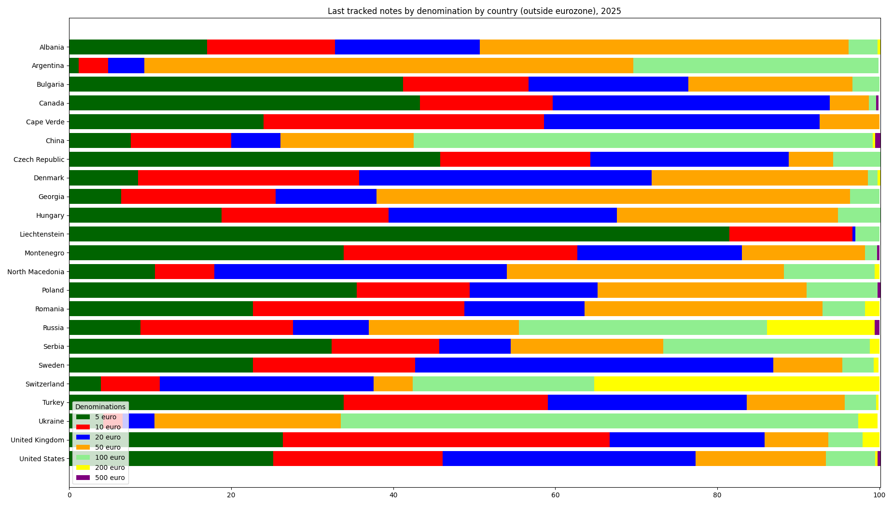

## Update last data for 2025

The data for the last 330 notes per country in 2025 resemble the data for 2022, 2023 and 2024

Last tracked notes by denomination by country (inside eurozone), 2025:

|Country|5 euro|10 euro|20 euro|50 euro|100 euro|200 euro|500 euro|
|-------|------|-------|-------|-------|--------|--------|--------|
|Andorra|41.5|21.2|20.6|15.5|0.9|0.3|0|
|Austria|60.3|16.4|14.8|6.7|1.8|0|0|
|Belgium|35.5|8.2|11.8|21.8|22.7|0|0|
|Croatia|10.6|37.6|27.9|19.1|4.8|0|0|
|Cyprus|22.7|15.5|42.1|16.7|3.0|0|0|
|Estonia|74.2|6.7|8.2|10.9|0|0|0|
|Finland|36.7|4.8|18.5|39.1|0|0.9|0|
|France|60.9|16.4|14.5|7.9|0.3|0|0|
|Germany|63.0|7.0|7.6|11.2|11.2|0|0|
|Greece|4.5|6.4|10.3|78.8|0|0|0|
|Ireland|33.0|34.2|13.6|15.5|3.6|0|0|
|Italy|13.9|42.7|17.3|25.8|0.3|0|0|
|Latvia|20.9|14.5|37.6|25.5|1.5|0|0|
|Lithuania|78.8|9.7|3.6|1.8|6.1|0|0|
|Luxembourg|22.1|26.1|27.6|21.2|3.0|0|0|
|Malta|11.2|23.6|29.4|34.8|0.6|0|0.3|
|Monaco|19.1|30.9|36.1|11.2|2.7|0|0|
|Netherlands|38.2|24.2|13.0|24.2|0.3|0|0|
|Portugal|45.8|23.3|23.0|2.7|4.8|0.3|0|
|Slovakia|10.6|36.7|45.5|3.6|3.6|0|0|
|Slovenia|38.2|27.6|11.2|19.1|3.9|0|0|
|Spain|25.2|25.5|20.3|28.8|0|0|0.3|

Last tracked notes by denomination by country (outside eurozone), 2025:

|Country|5 euro|10 euro|20 euro|50 euro|100 euro|200 euro|500 euro|
|-------|------|-------|-------|-------|--------|--------|--------|
|Albania|17.0|15.8|17.9|45.5|3.6|0.3|0|
|Argentina|1.2|3.6|4.5|60.3|30.3|0|0|
|Bulgaria|41.2|15.5|19.7|20.3|3.3|0|0|
|Canada|43.3|16.4|34.2|4.8|0.9|0|0.3|
|Cape Verde|24.0|34.6|34.0|7.4|0|0|0|
|China|7.6|12.4|6.1|16.4|56.7|0.3|0.6|
|Czech Republic|45.8|18.5|24.5|5.5|5.8|0|0|
|Denmark|8.5|27.3|36.1|26.7|1.2|0.3|0|
|Georgia|6.4|19.1|12.4|58.5|3.6|0|0|
|Hungary|18.8|20.6|28.2|27.3|5.2|0|0|
|Liechtenstein|81.5|15.2|0.3|0|3.0|0|0|
|Montenegro|33.9|28.8|20.3|15.2|1.5|0|0.3|
|North Macedonia|10.6|7.3|36.1|34.2|11.2|0.6|0|
|Poland|35.5|13.9|15.8|25.8|8.8|0|0.3|
|Romania|22.7|26.1|14.8|29.4|5.2|1.8|0|
|Russia|8.8|18.8|9.4|18.5|30.6|13.3|0.6|
|Serbia|32.4|13.3|8.8|18.8|25.5|1.2|0|
|Sweden|22.7|20.0|44.2|8.5|3.9|0.6|0|
|Switzerland|3.9|7.3|26.4|4.8|22.4|35.2|0|
|Turkey|33.9|25.2|24.5|12.1|3.9|0.3|0|
|Ukraine|4.2|2.4|3.9|23.0|63.9|2.4|0|
|United Kingdom|26.4|40.3|19.1|7.9|4.2|2.1|0|
|United States|25.2|20.9|31.2|16.1|6.1|0.3|0.3|

